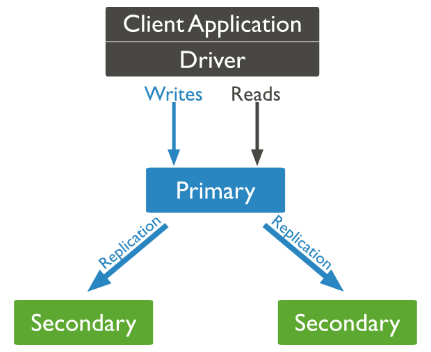

# Replica Set

> Replica Set 은 HA 솔루션이다.

## Membes

### primary

* Read / Write 모두 처리 가능
* Write 작업을 처리하는 유일한 멤버
* Replica Set에 하나만 존재할  수 있다.

### Secondary&#x20;

* Read 작업만 처리할 수 있다.
* 복제를 통해 primary와 동일한 데이터 셋을 유지한다.

## Automatic Failover

.png>)

Primary가 죽었을 경우 자동으로  Secondary중 하나를 Primary가 될 수 있다.

선출을 통해 과반수의 투표 받은 멤버가 Primary로  승격

## Oplog

Secondary 멤버는 Primary 멤버로 부터 변경이 기록된 로그를 가져와서&#x20;

다시 재생함으로써 Primary 와 Secondary 간의 데이터를 동기화

이것을 `Operation Log` 라고 하며 데이터베이스 서버의 "oplog.rs" 로 저장된다.

